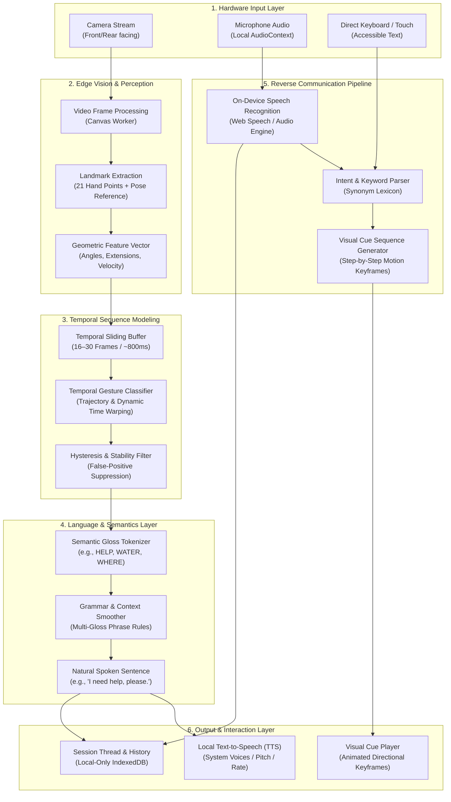

# SignEdge System Architecture & Design Specification

> **SignEdge — Communication without barriers.**
> *A production-oriented, offline-first, privacy-focused mobile accessibility communication platform.*

---

## 1. Architectural Philosophy

SignEdge is engineered to bridge communication between users of supported sign languages and spoken-language participants. Unlike cloud-centric translation platforms that stream live audio and video to remote multi-tenant servers, SignEdge is built on a **local-first, privacy-preserving, mobile-edge architecture**.

```
                           SIGNEDGE ARCHITECTURE
                                     │
           ┌─────────────────────────┴─────────────────────────┐
           ▼                                                   ▼
   OFFLINE CORE ENGINE                                OPTIONAL NETWORK SERVICES
           │                                                   │
  ┌────────┼────────┐                                 ┌────────┼────────┐
  ▼        ▼        ▼                                 ▼        ▼        ▼
Visual  Temporal  Local                              Model    Lexicon  Remote
Mesh    Model     NLP / TTS                         Updates  Download  Relay (Opt-in)
  │        │        │                                 │        │        │
  └────────┼────────┘                                 └────────┼────────┘
           ▼                                                   │
  LOCAL PRIVATE RESULT ◄───────────────────────────────────────┘
```

---

## 2. Core Subsystems

SignEdge is decomposed into decoupled, modular subsystems that communicate through typed interfaces:



---

## 3. Layer Breakdown

### Layer 1: Hardware Input Layer
- **Video Capture**: Uses `navigator.mediaDevices.getUserMedia` with fallback to front/rear camera selection (`facingMode: "user"` vs `"environment"`).
- **Audio Capture**: Employs Web Speech API or local `AudioContext` with zero telemetry recording.
- **Accessible Touch/Keyboard Input**: Every interactive control meets WCAG 2.1 AAA minimum touch targets (48px) and supports full keyboard navigation.

### Layer 2: Edge Vision & Perception
- Operates on client-side memory canvas (`<canvas>`) buffers.
- Extracts 21 normalized landmarks per hand (wrist, MCP, PIP, DIP, fingertips) and upper-body reference points (shoulders, elbows).
- Computes spatial metrics: joint angles, finger extension states, palm scale, and delta velocity vectors (\(dx/dt, dy/dt\)).

### Layer 3: Temporal Sequence Modeling
Signs cannot be classified from isolated static frames because sign language semantics rely inherently on **movement, trajectory, spatial inflection, and repetition**.
- A sliding FIFO window buffers normalized frames over a dynamic temporal span (16–30 frames).
- Trajectory evaluation calculates path curvature, directionality (upward, downward, chest, forward), and lateral oscillation (waving/shaking).
- Hysteresis thresholds require consecutive window confirmations before committing a recognized token to prevent jitter.

### Layer 4: Language & Semantics Layer
- Separates **vision recognition** from **natural sentence generation**.
- Translates raw gloss sequences (e.g., `["WHERE", "RESTROOM"]`) into fluent conversational English (`"Where is the nearest restroom?"`).

### Layer 5: Reverse Communication Pipeline
- Converts spoken audio from a hearing partner into structured visual sign sequences.
- Keyword mapping with canonical synonym normalization matches speech transcripts against our certified sign dictionary.

### Layer 6: Persistence & Storage
- Persists all conversation turns and preferences into client-side **IndexedDB** (`signedge_local_db`).
- Zero data is transmitted to cloud storage or third-party loggers.

---

## 4. Simplified Architecture for Non-Technical Stakeholders

```text
┌─────────────────────────────────────────────────────────────┐
│                       YOUR SMARTPHONE                       │
├──────────────────────────────┬──────────────────────────────┤
│       WHEN YOU SIGN          │        WHEN THEY SPEAK       │
│                              │                              │
│   1. Phone Camera sees sign  │   1. Microphone hears speech │
│   2. On-device AI recognizes │   2. Phone transcribes words │
│   3. Text appears on screen  │   3. Animated visual signs   │
│   4. Phone speaks out loud   │      guide you step-by-step  │
├──────────────────────────────┴──────────────────────────────┤
│  ✓ 100% On-Device Processing   ✓ Works without Internet     │
│  ✓ Private: Nothing leaves     ✓ Free & Open Accessibility  │
└─────────────────────────────────────────────────────────────┘
```

---

## 5. Deployment Architecture

```text
DEVELOPER REPOSITORY
        │
        ▼
AUTOMATED CI / CD
(Vitest + TypeScript Typecheck + Vite Build)
        │
        ▼
STATIC APPLICATION BUNDLE / PWA
(HTML, JS, CSS, Manifest, Offline Service Worker)
        │
        ▼
USER DEVICE BROWSER
(PWA Sandbox • IndexedDB • WebGPU / Canvas • Local Speech API)
```
